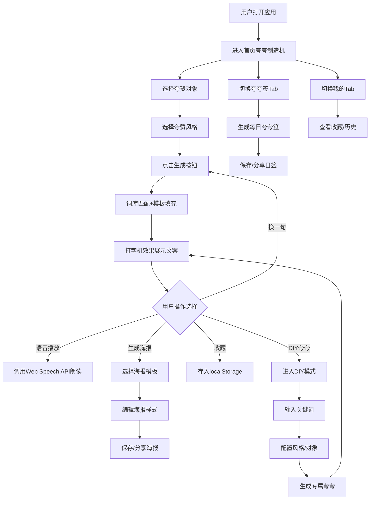

## 1. 产品概述

夸夸语录·彩虹屁制造机是一款治愈系娱乐H5网页工具，为用户提供即时的夸赞文案生成服务。无论是想夸朋友、恋人、家人，还是需要职场鼓励、自我打气，选择对象和风格后一键生成花式彩虹屁，支持复制、语音播放和高颜值海报分享。用温暖或搞怪的语言给生活加点糖，让传递赞美变得简单有趣。

- **核心价值**：降低表达赞美门槛，用创意文案传递温暖与快乐
- **目标用户**：18-35岁的年轻群体，喜欢社交分享、追求趣味互动的用户
- **市场定位**：轻量级娱乐工具，兼具治愈属性和社交传播性

## 2. 核心功能

### 2.1 用户角色

| 角色 | 注册方式 | 核心权限 |
|------|----------|----------|
| 普通用户 | 无需注册，直接使用 | 生成夸夸文案、DIY定制、语音播放、海报分享、夸夸签、夸夸对战、收藏管理 |

### 2.2 功能模块

1. **首页（夸夸制造机）**：对象选择器、风格选择器、夸夸生成区、操作栏（换一句/语音/海报/收藏）、DIY入口
2. **自定义夸夸（DIY模式）**：关键词输入、风格/对象附加配置、专属夸夸生成
3. **语音夸夸**：文字转语音播放、趣味音色切换、语音卡片生成
4. **海报生成与分享**：模板选择、海报预览、配色/贴纸编辑、保存/分享
5. **夸夸签（每日签）**：每日夸夸签生成、风格切换、壁纸保存/分享
6. **夸夸对战**：双人互夸对战、系统评分、单人练习模式、战绩分享
7. **我的收藏与历史**：收藏列表、生成历史、二次编辑/重新生成海报

### 2.3 页面详情

| 页面名称 | 模块名称 | 功能描述 |
|----------|----------|----------|
| 首页 | 标题区 | 动态气泡围绕标题，飘浮装饰元素 |
| 首页 | 对象选择器 | 横向滑动标签（8种对象），图标+文字，选中高亮 |
| 首页 | 风格选择器 | 标签式多选/单选（10种风格），圆角胶囊样式 |
| 首页 | 生成按钮 | 圆形大按钮"生成彩虹屁🌈"，按压动画 |
| 首页 | 夸夸展示区 | 打字机效果逐字显示，信纸/气泡背景，可复制 |
| 首页 | 操作栏 | 换一句/语音播放/生成海报/收藏四个操作按钮 |
| 首页 | DIY入口 | "DIY夸夸"入口卡片，点击进入自定义模式 |
| 首页 | 底部导航 | 制造机、夸夸签、我的三个Tab切换 |
| DIY夸夸页 | 关键词输入 | 文本输入框，支持填写夸赞方向/关键词 |
| DIY夸夸页 | 配置区 | 可选附加风格和对象选择 |
| DIY夸夸页 | 生成按钮 | "生成专属夸夸"按钮，模板匹配+融合生成 |
| DIY夸夸页 | 结果展示 | 同首页展示区，支持复制/语音/海报 |
| 语音夸夸页 | 音色选择 | 萝莉音/御姐音/卡通音等切换 |
| 语音夸夸页 | 播放控制 | 播放/暂停按钮，语音波纹动效 |
| 语音夸夸页 | 语音卡片 | 生成语音卡片，包含文案+播放按钮 |
| 海报生成页 | 模板选择 | 九宫格展示5-8套精美模板 |
| 海报生成页 | 海报预览 | 实时预览效果，配色切换 |
| 海报生成页 | 贴纸编辑 | 拖拽添加爱心、星星等装饰贴纸 |
| 海报生成页 | 分享操作 | 长按保存/直接分享朋友圈/聊天 |
| 夸夸签页 | 日签卡片 | 老黄历样式，日期+宜忌+今日夸夸 |
| 夸夸签页 | 风格切换 | 切换风格重新生成签文 |
| 夸夸签页 | 保存分享 | 保存为壁纸或分享 |
| 夸夸对战页 | 对战模式 | 左右分屏聊天框，两人轮流夸对方 |
| 夸夸对战页 | 评分系统 | 基于规则打分（关键词、长度、创意），搞笑评语 |
| 夸夸对战页 | 练习模式 | 单人练习，系统出题，用户回夸 |
| 夸夸对战页 | 战绩展示 | 比分展示，"夸夸之王"称号，战绩分享 |
| 我的页面 | 收藏列表 | 所有收藏夸夸，卡片式展示，按时间排序 |
| 我的页面 | 历史记录 | 生成历史，倒序展示 |
| 我的页面 | 二次操作 | 重新生成海报、切换风格、删除等 |

## 3. 核心流程

### 3.1 主要用户流程描述

用户打开应用后，默认进入首页夸夸制造机。选择夸赞对象（如闺蜜）和夸赞风格（如沙雕搞笑），点击生成按钮，系统从词库中随机匹配模板并填充词汇，以打字机效果展示夸夸文案。用户可以一键换一句、语音播放、生成海报或收藏。也可以点击DIY入口，输入关键词生成更专属的夸赞文案。用户可以切换到夸夸签Tab查看每日夸夸签，或进入我的页面查看收藏和历史记录。

### 3.2 核心流程图

## 4. 用户界面设计

### 4.1 设计风格

- **主色调**：马卡龙配色系统
  - 主色：樱花粉 `#FFB6C1`
  - 辅色：薰衣草紫 `#E6E6FA`、天蓝色 `#87CEEB`、柠檬黄 `#FFFACD`
  - 背景：粉紫到天蓝的渐变 `linear-gradient(135deg, #FFE5F1 0%, #E8F4FF 100%)`
  - 强调色：蜜桃橙 `#FFDAB9`、薄荷绿 `#98FB98`
- **按钮样式**：圆润胶囊按钮，大按钮带阴影和弹性按压动画，渐变色填充
- **字体**：
  - 标题：站酷快乐体（或ZCOOL KuaiLe Google Fonts替代）
  - 正文：沐瑶软笔手写体（或Ma Shan Zheng Google Fonts替代）
  - 备用：system-ui, -apple-system, sans-serif
- **布局风格**：卡片式布局，大圆角（16-24px），轻盈阴影，元素间大量留白
- **图标/emoji风格**：大量使用emoji增强趣味性（🌈💕✨🌸⭐🍬），线性图标配合圆润风格
- **装饰元素**：飘浮的云朵、星星、爱心、气泡等动画元素

### 4.2 页面设计概览

| 页面名称 | 模块名称 | UI元素 |
|----------|----------|--------|
| 首页 | 标题区 | 圆润手写体大标题，动态气泡浮动动画，渐变背景配星星装饰 |
| 首页 | 对象选择器 | 横向滚动容器，圆形图标+文字，选中态渐变边框+放大效果 |
| 首页 | 风格选择器 | 圆角胶囊标签，多行排列，选中态渐变填充+弹性动画 |
| 首页 | 生成按钮 | 超大圆形按钮，粉紫渐变，彩虹emoji，按压弹性动画+光晕效果 |
| 首页 | 夸夸展示区 | 信纸/气泡样式卡片，内边距充足，打字机光标，复制按钮 |
| 首页 | 操作栏 | 四个等宽圆角按钮，图标+文字，hover/active态微动效 |
| 首页 | 底部导航 | 固定底部，三栏Tab，图标+文字，选中态渐变上色+微弹起 |
| DIY夸夸页 | 输入区 | 大圆角输入框，占位符提示文字，字数统计 |
| 海报生成页 | 模板选择 | 九宫格网格，卡片缩略图，选中态金色边框+勾号 |
| 夸夸签页 | 日签卡片 | 老黄历复古风格，红黑配色，大日期数字，宜忌栏，夸夸正文 |
| 夸夸对战页 | 聊天区域 | 左右分屏，气泡对话样式，我方右对齐渐变气泡，对方左对齐 |
| 夸夸对战页 | 评分展示 | 星级评定动效，分数跳字动画，搞笑评语弹出 |
| 我的页面 | 列表卡片 | 瀑布流/列表布局，内容预览，操作按钮组 |

### 4.3 响应式设计

- **移动端优先**：以375px宽度为基准设计，使用flex/grid自适应布局
- **断点适配**：
  - 小屏手机（<375px）：缩小间距和字号，单行显示更多标签
  - 普通手机（375-768px）：标准设计稿呈现
  - 平板（768-1024px）：内容居中显示，两侧留白，卡片宽度限制
  - PC端（>1024px）：模拟手机宽度容器居中，两侧渐变背景装饰
- **触摸优化**：所有交互元素最小44x44px触摸区域，适当增大按钮间距
- **横屏适配**：检测横屏时提示用户切换竖屏获得最佳体验

### 4.4 动效设计

- **页面加载**：元素错位渐入动画（staggered fade-in），0.1s间隔
- **打字机效果**：逐字显示，光标闪烁动画
- **按钮交互**：
  - 点击：scale(0.95) → scale(1.05) → scale(1) 弹性动画
  - hover：轻微上浮+阴影加深
- **气泡浮动**：装饰元素使用CSS keyframes慢速上下浮动+左右漂移
- **卡片切换**：透明度渐变+轻微位移的slide效果
- **语音播放**：波形柱状图高度随时间随机变化的循环动画
- **星级评分**：逐个星星放大发光的序列动画
