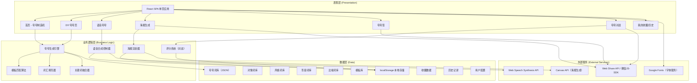

## 1. 架构设计



## 2. 技术选型说明

- **前端框架**：React@18 + React Router@6
  - 理由：组件化开发便于UI复用，React Router处理Tab切换和路由，生态成熟
- **构建工具**：Vite@5
  - 理由：启动速度快，HMR热更新流畅，开箱即用配置少
- **样式方案**：TailwindCSS@3 + 自定义CSS变量/动画
  - 理由：快速构建UI，原子类+自定义样式混合使用，动画配置方便
- **状态管理**：React useState/useReducer + Context API（轻量级场景）
  - 理由：项目复杂度不高，无需引入Redux等重型方案
- **海报生成**：HTML5 Canvas API + html2canvas（备选）
  - 理由：Canvas原生支持图片合成和文字渲染，可导出PNG
- **语音合成**：Web Speech Synthesis API
  - 理由：浏览器原生支持，无需后端服务，多音色可选
- **数据持久化**：localStorage
  - 理由：纯前端方案，无需后端，数据结构简单
- **图标方案**：emoji + lucide-react（线性图标库）
  - 理由：emoji增强趣味性，lucide-react提供精美线性图标

## 3. 路由定义

| 路由路径 | 页面组件 | 功能描述 |
|----------|----------|----------|
| `/` | HomePage | 首页（夸夸制造机），默认跳转路由 |
| `/diy` | DiyPage | 自定义夸夸（DIY模式） |
| `/poster` | PosterPage | 海报模板选择与生成 |
| `/daily` | DailyPage | 夸夸签（每日签） |
| `/battle` | BattlePage | 夸夸对战（双人/练习模式） |
| `/mine` | MinePage | 我的收藏与历史记录 |

## 4. 核心数据模型

### 4.1 词库数据结构

```typescript
// 夸夸对象类型
type PraiseTarget = 'bestie' | 'lover' | 'family' | 'colleague' | 'teacher' | 'idol' | 'self' | 'pet'

// 夸赞风格类型
type PraiseStyle = 'sweet' | 'literary' | 'funny' | 'sincere' | 'ancient' | 'workplace' | 'english' | 'ultimate' | 'earthly' | 'creative'

// 对象词库
interface TargetVocabulary {
  [key: PraiseTarget]: {
    name: string
    icon: string
    terms: string[]  // 对象称呼，如"亲爱的""闺蜜大人"
  }
}

// 形容词库
interface AdjectiveVocabulary {
  [key: PraiseStyle]: string[]
}

// 比喻词库
interface MetaphorVocabulary {
  [key: PraiseStyle]: string[]
}

// 模板库
interface TemplateLibrary {
  [key: PraiseStyle]: string[]  // 模板包含占位符 {对象} {形容词} {比喻} {神级描述}
}

// 完整夸夸文案
interface PraiseContent {
  id: string
  text: string
  target: PraiseTarget
  style: PraiseStyle
  timestamp: number
}
```

### 4.2 本地存储数据结构

```typescript
// 收藏项
interface FavoriteItem extends PraiseContent {
  favoritedAt: number
}

// 历史记录项
interface HistoryItem extends PraiseContent {
  keyword?: string  // DIY模式的关键词
}

// 用户配置
interface UserConfig {
  defaultTarget: PraiseTarget
  defaultStyle: PraiseStyle
  voiceType: 'default' | 'loli' | '御姐' | 'cartoon'
  posterTemplate: string
}

// 夸夸对战战绩
interface BattleRecord {
  id: string
  playerAName: string
  playerBName: string
  playerAScore: number
  playerBScore: number
  winner: 'A' | 'B' | 'draw'
  createdAt: number
}

// 完整本地存储
interface LocalStore {
  favorites: FavoriteItem[]
  history: HistoryItem[]
  config: UserConfig
  battles: BattleRecord[]
}
```

### 4.3 对战评分规则

```typescript
interface ScoringRule {
  keywordBonus: { words: string[]; score: number }[]  // 包含特定关键词加分
  lengthScore: { min: number; max: number; score: number }[]  // 长度区间加分
  creativityMultiplier: number  // 创意系数（不常见词汇匹配）
  maxScore: number
}
```

## 5. 核心模块设计

### 5.1 夸夸生成引擎

```typescript
// 生成引擎接口
interface PraiseGenerator {
  generate(target: PraiseTarget, style: PraiseStyle): PraiseContent
  generateWithKeyword(keyword: string, target?: PraiseTarget, style?: PraiseStyle): PraiseContent
  fillTemplate(template: string, data: TemplateData): string
}

// 模板填充数据
interface TemplateData {
  对象: string
  形容词: string
  比喻: string
  神级描述: string
  关键词?: string
}
```

### 5.2 海报渲染器

```typescript
// 海报模板定义
interface PosterTemplate {
  id: string
  name: string
  thumbnail: string
  background: 'gradient' | 'image' | 'solid' | 'paper'
  bgColor?: string
  gradient?: { from: string; to: string; angle: number }
  textStyle: {
    fontFamily: string
    fontSize: number
    color: string
    align: 'left' | 'center' | 'right'
  }
  decorations?: {
    type: 'sticker' | 'frame' | 'corner'
    position: { x: number; y: number }
    emoji?: string
  }[]
}

// 海报数据
interface PosterData {
  template: PosterTemplate
  content: string
  extraStickers?: { emoji: string; x: number; y: number; size: number }[]
}
```

## 6. 目录结构

```
src/
├── assets/                 # 静态资源
│   ├── fonts/              # 本地字体（备用）
│   ├── images/             # 图片资源
│   └── styles/             # 全局样式
│       ├── globals.css     # Tailwind指令+全局样式
│       ├── animations.css  # 动画keyframes定义
│       └── variables.css   # CSS变量（颜色、字体等）
├── components/             # 通用组件
│   ├── layout/
│   │   ├── Header.tsx      # 顶部标题栏
│   │   ├── BottomNav.tsx   # 底部导航
│   │   └── PageContainer.tsx
│   ├── ui/
│   │   ├── Button.tsx      # 通用按钮
│   │   ├── Card.tsx        # 通用卡片
│   │   ├── Tag.tsx         # 标签组件
│   │   ├── TagSelector.tsx # 标签选择器
│   │   └── Loading.tsx     # 加载动画
│   └── praise/
│       ├── PraiseCard.tsx      # 夸夸展示卡片
│       ├── TargetSelector.tsx  # 对象选择器
│       ├── StyleSelector.tsx   # 风格选择器
│       ├── ActionBar.tsx       # 操作栏
│       ├── Typewriter.tsx      # 打字机效果组件
│       └── FloatingBubbles.tsx # 浮动装饰气泡
├── pages/                  # 页面组件
│   ├── HomePage.tsx        # 首页
│   ├── DiyPage.tsx         # DIY夸夸
│   ├── PosterPage.tsx      # 海报生成
│   ├── DailyPage.tsx       # 夸夸签
│   ├── BattlePage.tsx      # 夸夸对战
│   └── MinePage.tsx        # 我的页面
├── data/                   # 数据/词库
│   ├── vocabulary.ts       # 词库数据
│   ├── templates.ts        # 模板数据
│   └── posterTemplates.ts  # 海报模板数据
├── hooks/                  # 自定义Hooks
│   ├── usePraiseGenerator.ts  # 夸夸生成Hook
│   ├── useSpeech.ts        # 语音合成Hook
│   ├── useLocalStorage.ts  # 本地存储Hook
│   └── useTypewriter.ts    # 打字机效果Hook
├── utils/                  # 工具函数
│   ├── generator.ts        # 生成算法
│   ├── storage.ts          # 存储工具
│   ├── scoring.ts          # 对战评分
│   ├── canvas.ts           # Canvas工具（海报）
│   └── share.ts            # 分享工具
├── types/                  # 类型定义
│   └── index.ts            # 所有TypeScript类型
├── App.tsx                 # 根组件（路由配置）
├── main.tsx                # 入口文件
└── vite-env.d.ts
```

## 7. 性能优化策略

1. **词库按需加载**：词库数据按风格/对象拆分，动态import分包加载
2. **图片懒加载**：海报模板缩略图使用懒加载
3. **虚拟列表**：收藏和历史记录数量多时使用虚拟滚动
4. **CSS动画优化**：使用transform和opacity属性，开启GPU加速
5. **防抖节流**：搜索/输入等高频操作使用防抖
6. **缓存策略**：生成结果短期缓存，避免重复计算
7. **字体优化**：使用font-display: swap，避免字体加载阻塞渲染
